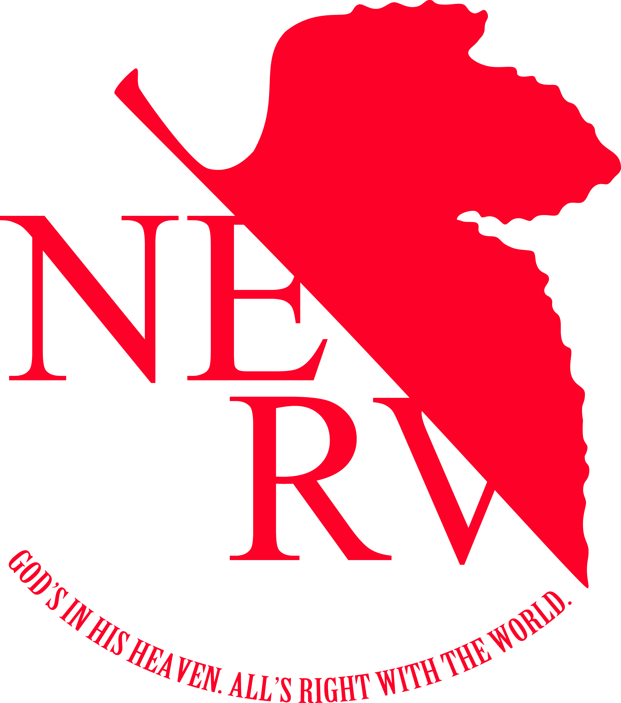

<p align="center">
  
</p>

 <h2 align="center">God’s in His Heaven – All’s Right With the World.</h2>
<a>
  
</a>

NERV + Outrun inspired based on Kanji v3.1 
<br />
<br />
<br />
## Changing links:

```html
<div class="column">
  <p>SECTION TITLE</p>
  <a class="link" href="WEBSITE LINK"> WEBSITE NAME </a>
  <!-- To make a link opening in a new tab, add 'target="_BLANK"' inside the link tag: -->
  <a target="_BLANK" class="link" href="WEBSITE LINK"> WEBSITE NAME </a>
</div>
```

```html
<div>: column container
├── <p>: section title
│    ├── <a>: bookmark
│    └── <a>: bookmark
└── <p>: section title
     ├── <a>: bookmark
     └── <a>: bookmark
</div>
```

## Keybindings:

| Key        | Function                                  |
| ---------- | ----------------------------------------- |
| `ctrl + m` | Mode - switch between light and dark mode |
| `/`        | Search - focus the search box             |

## Credits:

- [NERV Outrun // Image on left](https://old.reddit.com/r/evangelion/comments/hnftvs/nerv_vaporwave_wallpaper_3840_x_2160/)
- [NERV Logo // Favicon](https://www.deviantart.com/darqu13/art/NERV-render-191163009)
